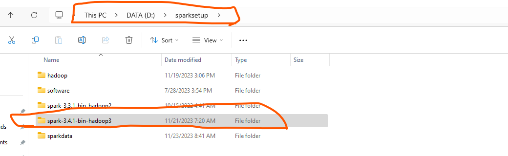

Setup Spark on Windows 11
1.  Download spark latest version from https://spark.apache.org/downloads
    Spark version used for this repo : spark-3.4.1-bin-hadoop3

2.  Download winutils.exe and hadoop.ddl from https://github.com/cdarlint/winutils/tree/master/hadoop-3.3.5/bin

3. Unzip spark to local directory on windows 11
4. 
5. Copy winutils.exe to local directory
6. 
7. copy hadoop.ddl to C:\Windows\System32
8. 
9. Add environment variables for SPARK_HOME and HADOOP_HOME
10. 
11. Edit Path variable
12. 
13. Add %SPARK_HOME%\bin and %HADOOP_HOME%\bin as shown below to Path variable
14. 